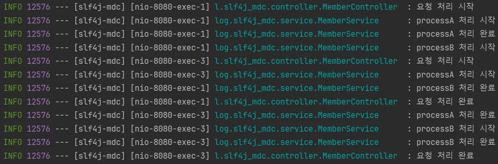
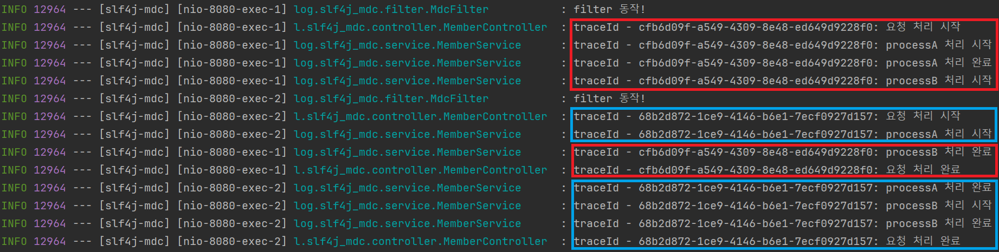

## MDC (Mapped Diagnostics Context)

- 요청에 처리되는 스레드마다 식별자를 할당해 실행 흐름을 추적할 수 있도록 할 수 있음
    - 멀티 스레드 환경에서는 각 요청에 대한 로그가 연속적으로 기록되지 않고 뒤섞이기 때문에 추적이 어려움
- Map 형식(key-value 쌍)의 저장소 지원
- ThreadLocal 기반으로 구현됨
    - Spring MVC는 스레드 풀을 사용해 요청을 처리한 스레드를 재사용하므로, 요청이 완료될 때 반드시 ThreadLocal을 clear 해줘야 함

### MDC가 없는 경우

예제

```java
@RestController
@Slf4j
@RequestMapping("/doSomething")
public class MemberController {
		// ...
    @GetMapping
    public void doSomething() {
        log.info("요청 처리 시작");
        memberService.process();
        log.info("요청 처리 완료");
    }
}
```

```java
@Service
@Slf4j
public class MemberService {

    public void process() {
        try {
            processA();
            processB();
        } catch (InterruptedException e) {
        }
    }

    public void processA() throws InterruptedException {
        log.info("processA 처리 시작");
        Thread.sleep(1000);
        log.info("processA 처리 완료");
    }

    public void processB() throws InterruptedException {
        log.info("processB 처리 시작");
        Thread.sleep(1000);
        log.info("processB 처리 완료");
    }
}
```



멀티 스레드 환경에서 여러 클라이언트로부터 요청을 받았을 때, 위와 같이 로그가 뒤섞이기 때문에 어떤 요청에 대한 로그인지 그 흐름을 추적하기가 어려움

이때 MDC를 사용하면 하나의 요청에 대해 식별자를 부여할 수 있음. 즉, 하나의 요청에 대한 로그를 그룹화 할 수 있게 됨

### MDC 적용

예제 - filter를 사용해 MDC 적용

```java
@Component
@Slf4j
public class MdcFilter implements Filter {

    @Override
    public void doFilter(ServletRequest request, ServletResponse response, FilterChain chain)
            throws IOException, ServletException {
        log.info("filter 동작!");
        MDC.put("traceId", UUID.randomUUID().toString());
        chain.doFilter(request, response);
    }
}
```

`MDC.put()` 을 사용해 Context에 값을 넣어줄 수 있음. 위 예제에서는 traceId로 UUID를 넣어줌



각각의 요청 별로 traceId를 부여해 그 흐름을 추적할 수 있게되었음

## 주의 사항

- MDC는 ThreadLocal을 사용해 구현되었기 때문에, `@Async` 어노테이션을 활용한 비동기 작업 등에서는 별도의 조치가 필요함
    - `@Async` 를 사용한 비동기 작업의 경우, 별도의 스레드에서 실행되기 때문에 아무 설정도 해주지 않으면 ThreadLocal의 Context를 공유할 수 없음. 수동으로 복사해줘야 함
